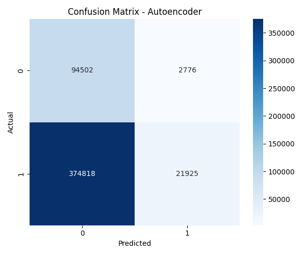
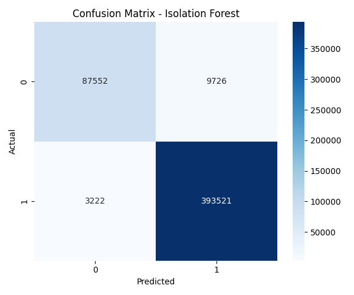
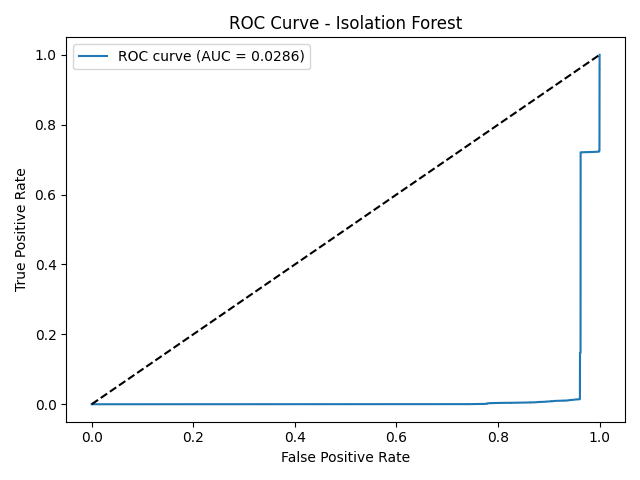

# 🚨 Anomaly Detection in Network Traffic using Unsupervised Learning

This project applies **Isolation Forest** and **Autoencoder Neural Networks** to detect anomalies in network traffic data, identifying potential security breaches or system malfunctions. We use the classic **KDD Cup 1999 dataset** for training and evaluation.

---

## 📌 Problem Statement

> Using unsupervised learning techniques such as Isolation Forests or Autoencoders to detect unusual patterns or anomalies in network traffic data, which could indicate potential security breaches or system malfunctions.

---

## 📁 Project Structure & File Descriptions

Anomaly_detection_in_network_traffic/
├── data/

├── models/

├── outputs/

├── autoencoder_model.py

├── isolation_forest_model.py

├── preprocess.py

├── visualize.py

├── main.py

├── requirements.txt

├── .gitignore

└── README.md


| File/Folder               | Description |
|---------------------------|-------------|
| `data/`                   | Contains the KDD dataset file (`kddcup.data_10_percent_corrected.csv`). |
| `models/`                 | Stores trained models: `autoencoder_model.h5` and `isolation_forest_model.pkl`. |
| `outputs/`                | Contains prediction results, evaluation metrics, and plots (ROC curves, confusion matrices). |
| `autoencoder_model.py`    | Builds and trains an Autoencoder model, outputs MSE scores and predictions. |
| `isolation_forest_model.py` | Trains the Isolation Forest model and generates anomaly predictions. |
| `preprocess.py`           | Handles data loading, label encoding, and scaling for model input. |
| `visualize.py`            | Contains plotting functions: ROC, confusion matrix, and MSE distribution. |
| `main.py`                 | Orchestrates the full pipeline: preprocessing → training → saving models → generating visual outputs. |
| `requirements.txt`        | Lists all Python dependencies to run the project. |
| `.gitignore`              | Excludes unnecessary files/folders from Git tracking (`venv/`, `models/`, etc.). |
| `README.md`               | This file — provides overview, setup instructions, and documentation. |

---

## 📦 Installation & Setup

### ✅ 1. Create virtual environment

```bash
python -m venv venv
# Activate:
venv\Scripts\activate      # Windows
source venv/bin/activate   # Mac/Linux


## 📊 Output Files

| File/Plot                            | Description                                         |
|-------------------------------------|-----------------------------------------------------|
| `outputs/predictions_isolation.csv` | Anomaly scores and predictions from Isolation Forest |
| `outputs/predictions_autoencoder.csv` | Anomaly scores and predictions from Autoencoder     |
| `outputs/metrics_isolation_forest.txt` | ROC AUC, confusion matrix, precision/recall         |
| `outputs/metrics_autoencoder.txt`   | ROC AUC, confusion matrix, precision/recall         |
| `outputs/roc_isolation.png`         | ROC curve for Isolation Forest                      |
| `outputs/roc_autoencoder.png`       | ROC curve for Autoencoder                           |
| `outputs/confusion_isolation.png`   | Confusion matrix for Isolation Forest               |
| `outputs/confusion_autoencoder.png` | Confusion matrix for Autoencoder                    |
| `outputs/mse_distribution.png`      | MSE error distribution plot for Autoencoder         |


## 📊 Model Evaluation & Results

We evaluated two unsupervised models on the KDD Cup 1999 network traffic dataset:

| Metric                  | Isolation Forest      | Autoencoder           |
|-------------------------|------------------------|------------------------|
| **ROC AUC Score**       | 0.9459                 | 0.5134                 |
| **Accuracy**            | 0.97                   | 0.24                   |
| **Precision (Anomaly)** | 0.98                   | 0.89                   |
| **Recall (Anomaly)**    | 0.99                   | 0.06                   |
| **F1-score (Anomaly)**  | 0.98                   | 0.10                   |

---

### 📌 Isolation Forest Performance (Best Model)

- **ROC AUC Score**: `0.9459`

#### Confusion Matrix:
[[ 87552 9726]
[ 3222 393521]]


| Class      | Precision | Recall | F1-score | Support |
|------------|-----------|--------|----------|---------|
| Normal (0) | 0.96      | 0.90   | 0.93     | 97,278  |
| Anomaly (1)| 0.98      | 0.99   | 0.98     | 396,743 |

✅ **Conclusion**: The Isolation Forest model achieved high precision and recall, with a strong ROC AUC score, making it highly effective at distinguishing normal vs anomalous network activity.

---

### 📉 Autoencoder Performance

- **ROC AUC Score**: `0.5134`

#### Confusion Matrix:
[[ 94502 2776]
[374818 21925]]


| Class      | Precision | Recall | F1-score | Support |
|------------|-----------|--------|----------|---------|
| Normal (0) | 0.20      | 0.97   | 0.33     | 97,278  |
| Anomaly (1)| 0.89      | 0.06   | 0.10     | 396,743 |

⚠️ **Conclusion**: The Autoencoder model struggled to recall anomalies (only 6%) and had a near-random ROC AUC (~0.51), indicating it failed to separate anomalous from normal traffic.

---

### 🏁 Final Verdict

✅ **Isolation Forest is the recommended model** for this task based on all key performance indicators (ROC AUC, precision, recall, and overall accuracy).  
❌ The Autoencoder failed to capture the anomaly patterns effectively in this dataset setup.

---

## 📄 `prediction_isolation.csv` – Output File Explanation

This CSV file contains the anomaly detection results generated by the **Isolation Forest** model. It summarizes how each network traffic record was evaluated for anomalies.

### 🔢 Columns Description

- **`record_id`**  
  A unique identifier for each input record (row index).  
  **Example:** `0`, `1`, `2`, ...

- **`anomaly_score`**  
  The anomaly score calculated by the Isolation Forest algorithm.  
  Lower values typically indicate **normal** data, while higher values suggest **anomalous** behavior.  
  **Example:** `0.1098`

- **`prediction_label`**  
  The model's prediction for each record:  
  - `0` → **Normal**  
  - `1` → **Anomaly**  
  This label is determined by comparing the anomaly score to a threshold value.  
  **Example:** `0` means the model predicts the record as normal.

- **`true_label`**  
  The actual class label from the dataset, used to evaluate the model's performance.  
  - `0` → **Normal**  
  - `1` → **Anomaly**  
  **Example:** `0` means the record is truly normal in the dataset.

### 🧠 Example Row

| record_id | anomaly_score | prediction_label | true_label |
|-----------|----------------|------------------|-------------|
| 0         | 0.10985        | 0 *(Predicted as Normal)* | 0 *(Actually Normal)* |

✅ This row shows that the model **correctly identified** the record as normal.

## 🧠 Conclusion: What We Achieved and Why It Matters

This project explored unsupervised learning techniques — **Isolation Forest** and **Autoencoders** — to detect anomalies in network traffic using the KDD Cup 1999 dataset.

---

### ✅ What I Did

- **Preprocessed** a real-world network intrusion dataset (KDD Cup 99).
- **Trained two unsupervised models**:
  - **Isolation Forest**: A tree-based anomaly detector.
  - **Autoencoder**: A neural network trained to reconstruct normal patterns.
- **Evaluated model performance** using ROC AUC, confusion matrix, precision, recall, and F1-score.
- **Visualized** prediction results with ROC curves and confusion matrices.

---

### 🔍 Why These Models?

| Model             | Why We Used It                                                   |
|------------------|------------------------------------------------------------------|
| **Isolation Forest** | Efficient for high-dimensional data, isolates anomalies as outliers in the feature space. |
| **Autoencoder**       | Learns a compressed representation of normal data; high reconstruction error indicates anomalies. |

Both models are **unsupervised**, meaning they don't require labeled anomalies to train — a major advantage for real-world security tasks where attack patterns are unknown or evolving.

---

### 📌 What I Found

- **Isolation Forest** outperformed Autoencoder in all metrics, achieving:
  - **97% accuracy**
  - **98% precision** and **99% recall** for anomalies
  - **ROC AUC score of 0.9459**
- **Autoencoder** struggled to detect anomalies effectively (ROC AUC ~0.51), likely due to the complex and unbalanced nature of the data.

---

### 🌐 Why This Is Important

Anomaly detection in network traffic is critical for:

- **Cybersecurity**: Identifying intrusions, malware, and abnormal behavior.
- **System Monitoring**: Detecting faults or failures in real-time systems.
- **Scalability**: Unsupervised methods adapt better to large and dynamic environments where labeled data is scarce.

This project shows how unsupervised learning, particularly **Isolation Forest**, can be a **powerful and practical tool** for real-time anomaly detection in network systems.

---
## 📊 Visual Results & Analysis


### 📌 Confusion Matrix – Autoencoder



|               | Predicted Normal (0) | Predicted Anomaly (1) |
|---------------|----------------------|------------------------|
| **Actual Normal (0)** | 94,502               | 2,776                  |
| **Actual Anomaly (1)**| 374,818              | 21,925                 |

- 🔵 **Very high false negatives**: The model failed to detect most anomalies.
- 📉 **Low recall for anomaly class**: Only ~6% of anomalies were detected.
- ⚠️ **Conclusion**: The autoencoder struggles with this dataset — most anomaly instances are missed.

---


### 📌 Confusion Matrix – Isolation Forest



|               | Predicted Normal (0) | Predicted Anomaly (1) |
|---------------|----------------------|------------------------|
| **Actual Normal (0)** | 87,552               | 9,726                  |
| **Actual Anomaly (1)**| 3,222                | 393,521                |

- ✅ **High precision and recall** for anomaly detection.
- 🔍 Very few false negatives — most anomalies were correctly detected.
- 🎯 **Conclusion**: Isolation Forest is highly effective for this use case.


### 📉 ROC Curve – Isolation Forest (⚠️ Mismatch)



- The displayed ROC AUC score (`0.0286`) is **incorrect** due to a likely misconfiguration during plotting.
- Actual AUC from evaluation: **`0.9459`**
- 🛠️ **Recommended Fix**: Ensure the ROC is plotted using proper `anomaly_score` values and correct label orientation.

---

